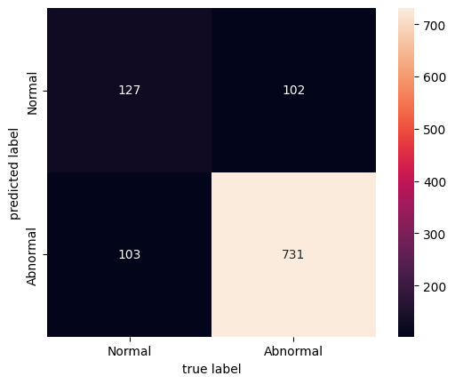
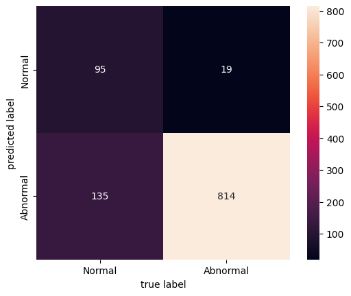
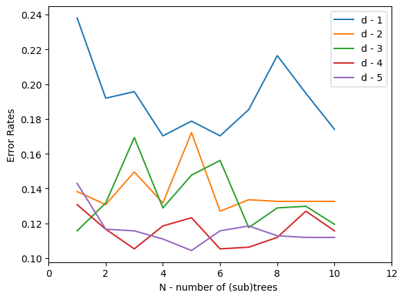
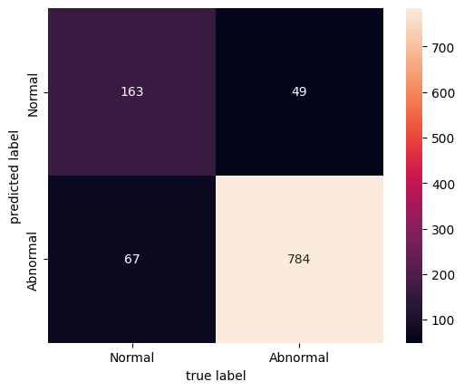

# Group 1: LB, ALTV, Min, Mean

## Question 1
### Q1 1.
```
FileName	Date	SegFile	b	e	LBE	LB	AC	FM	UC	...	C	D	E	AD	DE	LD	FS	SUSP	CLASS	NSP
2	Fmcs_1.txt	1996-05-03	CTG0002.txt	5.0	632.0	132.0	132.0	4.0	0.0	4.0	...	0.0	0.0	0.0	1.0	0.0	0.0	0.0	0.0	6.0	1.0
3	Fmcs_1.txt	1996-05-03	CTG0003.txt	177.0	779.0	133.0	133.0	2.0	0.0	5.0	...	0.0	0.0	0.0	1.0	0.0	0.0	0.0	0.0	6.0	1.0
4	Fmcs_1.txt	1996-05-03	CTG0004.txt	411.0	1192.0	134.0	134.0	2.0	0.0	6.0	...	0.0	0.0	0.0	1.0	0.0	0.0	0.0	0.0	6.0	1.0
5	Fmcs_1.txt	1996-05-03	CTG0005.txt	533.0	1147.0	132.0	132.0	4.0	0.0	5.0	...	0.0	0.0	0.0	0.0	0.0	0.0	0.0	0.0	2.0	1.0
6	Fmcs_2.txt	1996-05-03	CTG0006.txt	0.0	953.0	134.0	134.0	1.0	0.0	10.0	...	0.0	0.0	0.0	0.0	0.0	1.0	0.0	0.0	8.0	3.0
...	...	...	...	...	...	...	...	...	...	...	...	...	...	...	...	...	...	...	...	...	...
2122	S8001045.dsp	1998-06-06	CTG2124.txt	2059.0	2867.0	140.0	140.0	0.0	0.0	6.0	...	0.0	0.0	1.0	0.0	0.0	0.0	0.0	0.0	5.0	2.0
2123	S8001045.dsp	1998-06-06	CTG2125.txt	1576.0	2867.0	140.0	140.0	1.0	0.0	9.0	...	0.0	0.0	1.0	0.0	0.0	0.0	0.0	0.0	5.0	2.0
2124	S8001045.dsp	1998-06-06	CTG2126.txt	1576.0	2596.0	140.0	140.0	1.0	0.0	7.0	...	0.0	0.0	1.0	0.0	0.0	0.0	0.0	0.0	5.0	2.0
2125	S8001045.dsp	1998-06-06	CTG2127.txt	1576.0	3049.0	140.0	140.0	1.0	0.0	9.0	...	0.0	0.0	1.0	0.0	0.0	0.0	0.0	0.0	5.0	2.0
2126	S8001045.dsp	1998-06-06	CTG2128.txt	2796.0	3415.0	142.0	142.0	1.0	1.0	5.0	...	0.0	0.0	0.0	0.0	0.0	0.0	0.0	0.0	1.0	1.0
2125 rows × 40 columns
```

### Q1 2.

```
	FileName	Date	SegFile	b	e	LBE	LB	AC	FM	UC	...	C	D	E	AD	DE	LD	FS	SUSP	CLASS	NSP
2	Fmcs_1.txt	1996-05-03	CTG0002.txt	5.0	632.0	132.0	132.0	4.0	0.0	4.0	...	0.0	0.0	0.0	1.0	0.0	0.0	0.0	0.0	6.0	1
3	Fmcs_1.txt	1996-05-03	CTG0003.txt	177.0	779.0	133.0	133.0	2.0	0.0	5.0	...	0.0	0.0	0.0	1.0	0.0	0.0	0.0	0.0	6.0	1
4	Fmcs_1.txt	1996-05-03	CTG0004.txt	411.0	1192.0	134.0	134.0	2.0	0.0	6.0	...	0.0	0.0	0.0	1.0	0.0	0.0	0.0	0.0	6.0	1
5	Fmcs_1.txt	1996-05-03	CTG0005.txt	533.0	1147.0	132.0	132.0	4.0	0.0	5.0	...	0.0	0.0	0.0	0.0	0.0	0.0	0.0	0.0	2.0	1
6	Fmcs_2.txt	1996-05-03	CTG0006.txt	0.0	953.0	134.0	134.0	1.0	0.0	10.0	...	0.0	0.0	0.0	0.0	0.0	1.0	0.0	0.0	8.0	0
...	...	...	...	...	...	...	...	...	...	...	...	...	...	...	...	...	...	...	...	...	...
2122	S8001045.dsp	1998-06-06	CTG2124.txt	2059.0	2867.0	140.0	140.0	0.0	0.0	6.0	...	0.0	0.0	1.0	0.0	0.0	0.0	0.0	0.0	5.0	0
2123	S8001045.dsp	1998-06-06	CTG2125.txt	1576.0	2867.0	140.0	140.0	1.0	0.0	9.0	...	0.0	0.0	1.0	0.0	0.0	0.0	0.0	0.0	5.0	0
2124	S8001045.dsp	1998-06-06	CTG2126.txt	1576.0	2596.0	140.0	140.0	1.0	0.0	7.0	...	0.0	0.0	1.0	0.0	0.0	0.0	0.0	0.0	5.0	0
2125	S8001045.dsp	1998-06-06	CTG2127.txt	1576.0	3049.0	140.0	140.0	1.0	0.0	9.0	...	0.0	0.0	1.0	0.0	0.0	0.0	0.0	0.0	5.0	0
2126	S8001045.dsp	1998-06-06	CTG2128.txt	2796.0	3415.0	142.0	142.0	1.0	1.0	5.0	...	0.0	0.0	0.0	0.0	0.0	0.0	0.0	0.0	1.0	1
2125 rows × 40 columns
```

## Question 2

### Q2 1.
Naive Bayesian
```
	LB	ALTV	Min	Mean	NSP	predict
1004	129.0	0.0	108.0	142.0	1	1
925	122.0	0.0	93.0	130.0	1	1
2001	125.0	0.0	71.0	117.0	1	1
476	150.0	37.0	140.0	150.0	0	0
1201	143.0	0.0	130.0	148.0	1	1
...	...	...	...	...	...	...
999	129.0	0.0	114.0	138.0	1	1
1976	135.0	0.0	124.0	144.0	1	1
1769	120.0	0.0	69.0	98.0	0	1
2104	133.0	6.0	91.0	132.0	1	1
106	125.0	0.0	56.0	123.0	1	1
1063 rows × 6 columns
```

### Q2 2.

Accuracy NB - 0.8071495766698025

### Q2 3.
Naive Bayesian\


## Question 3

### Q3 1.
Decision Tree Classifier
```
	LB	ALTV	Min	Mean	NSP	predict
1004	129.0	0.0	108.0	142.0	1	1
925	122.0	0.0	93.0	130.0	1	1
2001	125.0	0.0	71.0	117.0	1	1
476	150.0	37.0	140.0	150.0	0	1
1201	143.0	0.0	130.0	148.0	1	1
...	...	...	...	...	...	...
999	129.0	0.0	114.0	138.0	1	1
1976	135.0	0.0	124.0	144.0	1	1
1769	120.0	0.0	69.0	98.0	0	0
2104	133.0	6.0	91.0	132.0	1	1
106	125.0	0.0	56.0	123.0	1	1
1063 rows × 6 columns
```

### Q3 2.

Accuracy Decision Tree Classifier - 0.8551269990592663

### Q3 3.
Decision Tree Classifier\


## Question 4

### Q4 1.

Random Forest Classifier - 
N - 1 Max depth d - 1  Error Rate - 0.23800564440263405\
N - 2 Max depth d - 1  Error Rate - 0.19190968955785515\
N - 3 Max depth d - 1  Error Rate - 0.1956726246472248\
N - 4 Max depth d - 1  Error Rate - 0.17027281279397932\
N - 5 Max depth d - 1  Error Rate - 0.1787394167450611\
N - 6 Max depth d - 1  Error Rate - 0.17027281279397932\
N - 7 Max depth d - 1  Error Rate - 0.18532455315145813\
N - 8 Max depth d - 1  Error Rate - 0.21636876763875823\
N - 9 Max depth d - 1  Error Rate - 0.1947318908748824\
N - 10 Max depth d - 1  Error Rate - 0.17403574788334897\
N - 1 Max depth d - 2  Error Rate - 0.13828786453433684\
N - 2 Max depth d - 2  Error Rate - 0.13076199435559732\
N - 3 Max depth d - 2  Error Rate - 0.14957666980244588\
N - 4 Max depth d - 2  Error Rate - 0.13170272812793982\
N - 5 Max depth d - 2  Error Rate - 0.1721542803386642\
N - 6 Max depth d - 2  Error Rate - 0.12699905926622768\
N - 7 Max depth d - 2  Error Rate - 0.1335841956726247\
N - 8 Max depth d - 2  Error Rate - 0.1326434619002822\
N - 9 Max depth d - 2  Error Rate - 0.1326434619002822\
N - 10 Max depth d - 2  Error Rate - 0.1326434619002822\
N - 1 Max depth d - 3  Error Rate - 0.11571025399811852\
N - 2 Max depth d - 3  Error Rate - 0.13170272812793982\
N - 3 Max depth d - 3  Error Rate - 0.16933207902163683\
N - 4 Max depth d - 3  Error Rate - 0.12888052681091255\
N - 5 Max depth d - 3  Error Rate - 0.147695202257761\
N - 6 Max depth d - 3  Error Rate - 0.1561618062088429\
N - 7 Max depth d - 3  Error Rate - 0.1175917215428034\
N - 8 Max depth d - 3  Error Rate - 0.12888052681091255\
N - 9 Max depth d - 3  Error Rate - 0.12982126058325494\
N - 10 Max depth d - 3  Error Rate - 0.11947318908748827\
N - 1 Max depth d - 4  Error Rate - 0.13076199435559732\
N - 2 Max depth d - 4  Error Rate - 0.11665098777046101\
N - 3 Max depth d - 4  Error Rate - 0.10536218250235185\
N - 4 Max depth d - 4  Error Rate - 0.11853245531514578\
N - 5 Max depth d - 4  Error Rate - 0.12323612417685792\
N - 6 Max depth d - 4  Error Rate - 0.10536218250235185\
N - 7 Max depth d - 4  Error Rate - 0.10630291627469424\
N - 8 Max depth d - 4  Error Rate - 0.11194731890874887\
N - 9 Max depth d - 4  Error Rate - 0.12699905926622768\
N - 10 Max depth d - 4  Error Rate - 0.11571025399811852\
N - 1 Max depth d - 5  Error Rate - 0.14299153339604886\
N - 2 Max depth d - 5  Error Rate - 0.11665098777046101\
N - 3 Max depth d - 5  Error Rate - 0.11571025399811852\
N - 4 Max depth d - 5  Error Rate - 0.11100658513640638\
N - 5 Max depth d - 5  Error Rate - 0.10442144873000936\
N - 6 Max depth d - 5  Error Rate - 0.11571025399811852\
N - 7 Max depth d - 5  Error Rate - 0.11853245531514578\
N - 8 Max depth d - 5  Error Rate - 0.11288805268109126\
N - 9 Max depth d - 5  Error Rate - 0.11194731890874887\
N - 10 Max depth d - 5  Error Rate - 0.11194731890874887

### Q4 2.


Random Forest Max accuracy - 0.8955785512699906 for N - 5 and d - 5

### Q4 3.

Random Forest Max accuracy - 0.8955785512699906 for N - 5 and d - 5

### Q4 4.


## Question 5

```
Model	TP	FP	TN	FN	accuracy	TPR	TNR
naive bayesian	731	103	127	102	0.807150	0.877551	0.552174
decision tree	814	135	95	19	0.855127	0.977191	0.413043
random forest	784	67	163	49	0.890875	0.941176	0.708696
```