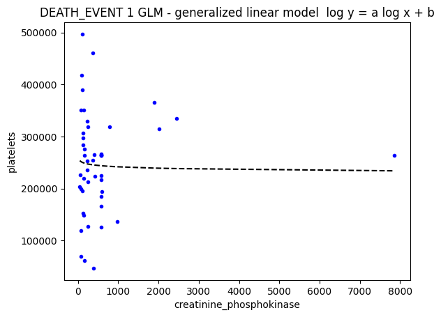
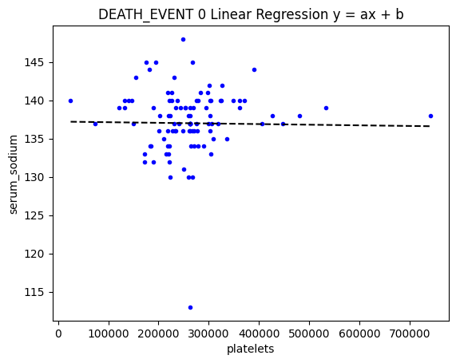
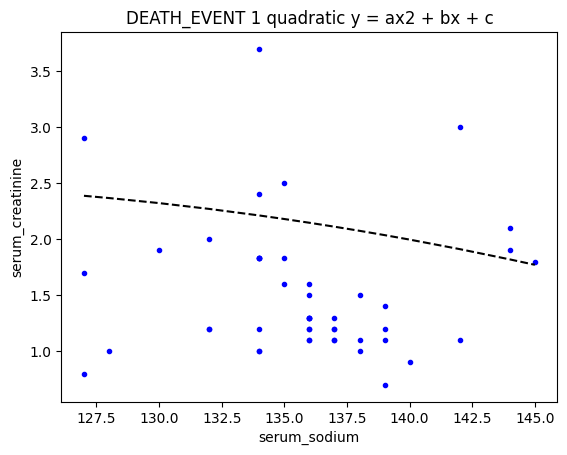

## Question 1
### Q1 1.
Death Event 0
```
	creatinine_phosphokinase	serum_creatinine	serum_sodium	platelets	DEATH_EVENT
14	80	1.0	138	427000.0	0
20	52	1.3	137	276000.0	0
23	63	0.8	135	368000.0	0
33	159	1.2	138	302000.0	0
38	2656	2.3	137	305000.0	0
...	...	...	...	...	...
294	61	1.1	143	155000.0	0
295	1820	1.2	139	270000.0	0
296	2060	0.8	138	742000.0	0
297	2413	1.4	140	140000.0	0
298	196	1.6	136	395000.0	0
203 rows × 5 columns
```
Death Event 1
```
	creatinine_phosphokinase	serum_creatinine	serum_sodium	platelets	DEATH_EVENT
0	582	1.90	130	265000.00	1
1	7861	1.10	136	263358.03	1
2	146	1.30	129	162000.00	1
3	111	1.90	137	210000.00	1
4	160	2.70	116	327000.00	1
...	...	...	...	...	...
220	582	1.83	134	263358.03	1
230	166	1.70	127	62000.00	1
246	2017	1.10	138	314000.00	1
262	258	1.40	129	198000.00	1
266	1199	1.83	134	263358.03	1
96 rows × 5 columns
```

### Q1 2.

Death Event 0
```
	creatinine_phosphokinase	serum_creatinine	serum_sodium	platelets
creatinine_phosphokinase	1.000000	-0.043110	-0.002474	-0.012940
serum_creatinine	-0.043110	1.000000	-0.215651	-0.031217
serum_sodium	-0.002474	-0.215651	1.000000	0.001807
platelets	-0.012940	-0.031217	0.001807	1.000000
```


Death Event 1
```
	creatinine_phosphokinase	serum_creatinine	serum_sodium	platelets
creatinine_phosphokinase	1.000000	-0.033407	0.148823	0.078808
serum_creatinine	-0.033407	1.000000	-0.094011	-0.029384
serum_sodium	0.148823	-0.094011	1.000000	0.141284
platelets	0.078808	-0.029384	0.141284	1.000000
```


### Q1 3.
#### a)
serum_sodium and creatinine_phosphokinase have the highest correlation for surviving patients
#### b)
serum_sodium and serum_creatinine have the lowest correlation for surviving patients
#### c)
serum_sodium and creatinine_phosphokinase have the highest correlation for deceased patients
#### d)
serum_sodium and serum_creatinine have the lowest correlation for deceased patients

## Question 2

### Q2 1.
Group - 1 ['creatinine_phosphokinase', 'platelets']

DEATH_EVENT 0 Linear Regression y = ax + b\
a= -12.056252013903174 b= 277836.3748904729\
SSE = 86268284695140.94

DEATH_EVENT 0 quadratic y = ax2 + bx + c\
a= -19.71500724390465 b= 0.003473895167648312 c= 279623.1091852791\
SSE = 85858520623116.44\

DEATH_EVENT 0 cubic spline  y = ax3 + bx2 + cx + d\
a= 43.685770256837266 b= -0.0756564247701897 c= 2.1757802860164488e-05 d= 271414.33817792987\
SSE = 308981266636131.7

DEATH_EVENT 0 GLM - generalized linear model  y = a log x + b\
a= -2526.0275790125534 b= 286230.20174363826\
SSE = 85404313518196.0

DEATH_EVENT 0 GLM - generalized linear model  log y = a log x + b\
a= -0.022620571643850697 b= 12.573733849525707\
SSE = 85129802604718.23

DEATH_EVENT 1 Linear Regression y = ax + b\
a= 4.532841029553679 b= 260958.30654938702\
SSE = 21673129833826.414

DEATH_EVENT 1 quadratic y = ax2 + bx + c\
a= -43.6971646754312 b= 0.007292255417581923 c= 278391.51736943494\
SSE = 22908175840926.992

DEATH_EVENT 1 cubic spline  y = ax3 + bx2 + cx + d\
a= -17.969919437517238 b= -0.004255613315961509 c= 1.1203291195357318e-06 d= 271770.8207854917\
SSE = 23110455826344.88

DEATH_EVENT 1 GLM - generalized linear model  y = a log x + b\
a= 252.91767830090967 b= 262930.6007441235\
SSE = 21662980075280.24

DEATH_EVENT 1 GLM - generalized linear model  log y = a log x + b\
a= -0.015723349980061384 b= 12.503826073216116\
SSE = 21120845867702.18

```
                   Model  SSE (death event=0)  SSE (death event=1)
              y = ax + b         8.626828e+13         2.167313e+13
        y = ax2 + bx + c         8.585852e+13         2.290818e+13
  y = ax3 + bx2 + cx + d         3.089813e+14         2.311046e+13
         y = a log x + b         8.540431e+13         2.166298e+13
     log y = a log x + b         8.512980e+13         2.112085e+13
```

| Death Event   | y = ax + b        | y = ax2 + bx + c  | y = ax3 + bx2 + cx + d | y = a log x + b   | log y = a log x + b |
|---------------|-------------------|-------------------|------------------------|-------------------|---------------------|
| Death Event 0 |  |  |       |  |    |
| Death Event 1 |  |  |       |  |    |

Group - 2 ['platelets', 'serum_sodium']


DEATH_EVENT 0 Linear Regression y = ax + b\
a= -8.176450693049772e-07 b= 137.22249780439034\
SSE = 182761.28169131547

DEATH_EVENT 0 quadratic y = ax2 + bx + c\
a= -2.0824890780328707e-05 b= 2.6831863871160218e-11 c= 140.3902619170264\
SSE = 186733.4692964463

DEATH_EVENT 0 cubic spline  y = ax3 + bx2 + cx + d\
a= -2.742426774847624e-05 b= 4.5332811651327624e-11 c= -1.415859377657581e-17 d= 141.0572307234887\
SSE = 187456.0116006601

DEATH_EVENT 0 GLM - generalized linear model  y = a log x + b\
a= -0.7871790911372236 b= 146.79831689853538\
SSE = 183492.54232138384

DEATH_EVENT 0 GLM - generalized linear model  log y = a log x + b\
a= -0.005774794258581867 b= 4.991483291633895\
SSE = 183964.45616100216

DEATH_EVENT 1 Linear Regression y = ax + b\
a= 9.19144532213112e-06 b= 132.52819367170073\
SSE = 41335.78932234564

DEATH_EVENT 1 quadratic y = ax2 + bx + c\
a= 1.63688307475912e-05 b= -1.1456412576314803e-11 c= 131.54523739449937\
SSE = 41971.3667369804

DEATH_EVENT 1 cubic spline  y = ax3 + bx2 + cx + d\
a= 2.9208355515999705e-05 b= -5.484666969957573e-11 c= 4.269337970077253e-17 d= 130.44785014935147\
SSE = 42334.60288625662

DEATH_EVENT 1 GLM - generalized linear model  y = a log x + b\
a= 2.3553836859707302 b= 105.72093798887572\
SSE = 42710.77765614027

DEATH_EVENT 1 GLM - generalized linear model  log y = a log x + b\
a= 0.017606934592944663 b= 4.685483882556029\
SSE = 43330.57283552625

```
                   Model  SSE (death event=0)  SSE (death event=1)
              y = ax + b        182761.281691         41335.789322
        y = ax2 + bx + c        186733.469296         41971.366737
  y = ax3 + bx2 + cx + d        187456.011601         42334.602886
         y = a log x + b        183492.542321         42710.777656
     log y = a log x + b        183964.456161         43330.572836
```

| Death Event   | y = ax + b        | y = ax2 + bx + c  | y = ax3 + bx2 + cx + d | y = a log x + b   | log y = a log x + b |
|---------------|-------------------|-------------------|------------------------|-------------------|---------------------|
| Death Event 0 |  |  |       |  |    |
| Death Event 1 |  |  |       |  |    |

Group - 3 ['serum_sodium', 'serum_creatinine']

DEATH_EVENT 0 Linear Regression y = ax + b\
a= -0.040189873417721504 b= 6.75007206416844\
SSE = 3874.059248590759

DEATH_EVENT 0 quadratic y = ax2 + bx + c\
a= -1.9537167599528058 b= 0.007026849999361861 c= 136.91737539928297\
SSE = 6039.196371122711

DEATH_EVENT 0 cubic spline  y = ax3 + bx2 + cx + d\
a= 62.847579886456984 b= -0.47163474320788473 c= 0.001177436779252583 d= -2784.5126340910338\
SSE = 10011.98447879598

DEATH_EVENT 0 GLM - generalized linear model  y = a log x + b\
a= -5.590372166982144 b= 28.746466817806457\
SSE = 3901.9030942929285

DEATH_EVENT 0 GLM - generalized linear model  log y = a log x + b\
a= -3.2701487931261357 b= 16.202059380822302\
SSE = 3660.488593572101

DEATH_EVENT 1 Linear Regression y = ax + b\
a= -0.029067323394616228 b= 6.076835853131748\
SSE = 1711.028583208675

DEATH_EVENT 1 quadratic y = ax2 + bx + c\
a= 0.1914993822214988 b= -0.0008299168744180171 c= -8.547227977225925\
SSE = 1752.2997894139824

DEATH_EVENT 1 cubic spline  y = ax3 + bx2 + cx + d\
a= 27.052205391391944 b= -0.20549910060424093 c= 0.0005184434287653916 d= -1180.3158700827057\
SSE = 1749.0841068373513

DEATH_EVENT 1 GLM - generalized linear model  y = a log x + b\
a= -3.7992155279965263 b= 20.78545904779382\
SSE = 1706.019567943716

DEATH_EVENT 1 GLM - generalized linear model  log y = a log x + b\
a= -3.710591082424667 b= 18.714685292251932\
SSE = 933.8600744666578
```
                   Model  SSE (death event=0)  SSE (death event=1)
              y = ax + b          3874.059249          1711.028583
        y = ax2 + bx + c          6039.196371          1752.299789
  y = ax3 + bx2 + cx + d         10011.984479          1749.084107
         y = a log x + b          3901.903094          1706.019568
     log y = a log x + b          3660.488594           933.860074
```

| Death Event   | y = ax + b        | y = ax2 + bx + c  | y = ax3 + bx2 + cx + d | y = a log x + b   | log y = a log x + b |
|---------------|-------------------|-------------------|------------------------|-------------------|---------------------|
| Death Event 0 |  |  |       |  |    |
| Death Event 1 |  |  |       |  |    |

Group - 4 ['platelets', 'serum_creatinine']

DEATH_EVENT 0 Linear Regression y = ax + b\
a= -2.765441621615004e-07 b= 1.319312680506541\
SSE = 3635.209589074442

DEATH_EVENT 0 quadratic y = ax2 + bx + c\
a= -1.74246364726518e-06 b= 1.965955366295674e-12 c= 1.551412950778464\
SSE = 3659.124039769493

DEATH_EVENT 0 cubic spline  y = ax3 + bx2 + cx + d\
a= -5.5555141451919355e-06 b= 1.265560811754054e-11 c= -8.180686343941246e-18 d= 1.93678050138503\
SSE = 3700.4638589206497

DEATH_EVENT 0 GLM - generalized linear model  y = a log x + b\
a= -0.15575876590201154 b= 3.1828478788761005\
SSE = 3673.0758917302837

DEATH_EVENT 0 GLM - generalized linear model  log y = a log x + b\
a= -0.09861413602616599 b= 1.3417156439004114\
SSE = 3497.7393704806514

DEATH_EVENT 1 Linear Regression y = ax + b\
a= -1.2766737633271879e-06 b= 2.4914999754249187\
SSE = 1844.4231072837501

DEATH_EVENT 1 quadratic y = ax2 + bx + c\
a= -3.3031525965964895e-06 b= 3.2346287979391846e-12 c= 2.7690300189853287\
SSE = 1880.9249439069777

DEATH_EVENT 1 cubic spline  y = ax3 + bx2 + cx + d\
a= -1.3786312676545847e-05 b= 3.86617197146506e-11 c= -3.485810742248089e-17 d= 3.6650200472350765\
SSE = 2019.1768235544728

DEATH_EVENT 1 GLM - generalized linear model  y = a log x + b\
a= -0.33176558999341255 b= 6.272167088068326\
SSE = 1891.2805972511596

DEATH_EVENT 1 GLM - generalized linear model  log y = a log x + b\
a= -0.1288125100482462 b= 2.116752958308727\
SSE = 920.4136605918726

```
                   Model  SSE (death event=0)  SSE (death event=1)
              y = ax + b          3635.209589          1844.423107
        y = ax2 + bx + c          3659.124040          1880.924944
  y = ax3 + bx2 + cx + d          3700.463859          2019.176824
         y = a log x + b          3673.075892          1891.280597
     log y = a log x + b          3497.739370           920.413661
```

| Death Event   | y = ax + b        | y = ax2 + bx + c  | y = ax3 + bx2 + cx + d | y = a log x + b   | log y = a log x + b |
|---------------|-------------------|-------------------|------------------------|-------------------|---------------------|
| Death Event 0 |  |  |       |  |    |
| Death Event 1 |  |  |       |  |    |

### Q3.

Group - 1 ['creatinine_phosphokinase', 'platelets']

```
                   Model  SSE (death event=0)  SSE (death event=1)
              y = ax + b         8.626828e+13         2.167313e+13
        y = ax2 + bx + c         8.585852e+13         2.290818e+13
  y = ax3 + bx2 + cx + d         3.089813e+14         2.311046e+13
         y = a log x + b         8.540431e+13         2.166298e+13
     log y = a log x + b         8.512980e+13         2.112085e+13
```

Group - 2 ['platelets', 'serum_sodium']

```
                   Model  SSE (death event=0)  SSE (death event=1)
              y = ax + b        182761.281691         41335.789322
        y = ax2 + bx + c        186733.469296         41971.366737
  y = ax3 + bx2 + cx + d        187456.011601         42334.602886
         y = a log x + b        183492.542321         42710.777656
     log y = a log x + b        183964.456161         43330.572836
```

Group - 3 ['serum_sodium', 'serum_creatinine']

```
                   Model  SSE (death event=0)  SSE (death event=1)
              y = ax + b          3874.059249          1711.028583
        y = ax2 + bx + c          6039.196371          1752.299789
  y = ax3 + bx2 + cx + d         10011.984479          1749.084107
         y = a log x + b          3901.903094          1706.019568
     log y = a log x + b          3660.488594           933.860074
```

Group - 4 ['platelets', 'serum_creatinine']

```
                   Model  SSE (death event=0)  SSE (death event=1)
              y = ax + b          3635.209589          1844.423107
        y = ax2 + bx + c          3659.124040          1880.924944
  y = ax3 + bx2 + cx + d          3700.463859          2019.176824
         y = a log x + b          3673.075892          1891.280597
     log y = a log x + b          3497.739370           920.413661
```

### Q3 1.

Group - 1 ['creatinine_phosphokinase', 'platelets']\
Best Model(Smallest SSE) Death event 0  - y = ax3 + bx2 + cx + d\
Best Model(Smallest SSE) Death event 1  - log y = a log x + b

Group - 2 ['platelets', 'serum_sodium']\
Best Model(Smallest SSE) Death event 0  - y = ax + b\
Best Model(Smallest SSE) Death event 1  - y = ax2 + bx + c

Group - 3 ['serum_sodium', 'serum_creatinine']\
Best Model(Smallest SSE) Death event 0  - log y = a log x + b\
Best Model(Smallest SSE) Death event 1  - log y = a log x + b

Group - 4 ['platelets', 'serum_creatinine']\
Best Model(Smallest SSE) Death event 0  - log y = a log x + b\
Best Model(Smallest SSE) Death event 1  - log y = a log x + b

### Q3 2.

Group - 1 ['creatinine_phosphokinase', 'platelets']\
Worst Model(Highest SSE) Death event 0  - y = ax + b\
Worst Model(Highest SSE) Death event 1  - y = ax3 + bx2 + cx + d

Group - 2 ['platelets', 'serum_sodium']\
Worst Model(Highest SSE) Death event 0  - y = ax3 + bx2 + cx + d\
Worst Model(Highest SSE) Death event 1  - log y = a log x + b

Group - 3 ['serum_sodium', 'serum_creatinine']\
Worst Model(Highest SSE) Death event 0  - y = ax3 + bx2 + cx + d\
Worst Model(Highest SSE) Death event 1  - y = ax2 + bx + c

Group - 4 ['platelets', 'serum_creatinine']\
Worst Model(Highest SSE) Death event 0  - y = ax3 + bx2 + cx + d\
Worst Model(Highest SSE) Death event 1  - y = ax3 + bx2 + cx + d