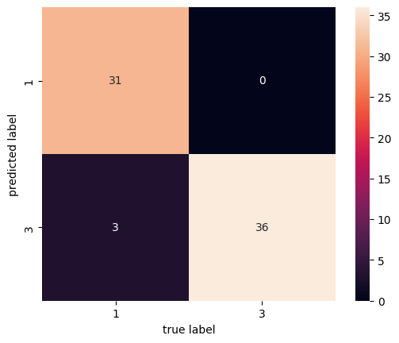
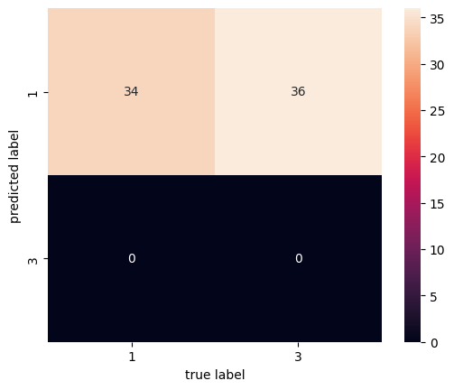
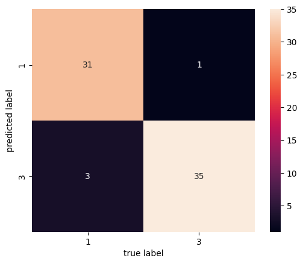
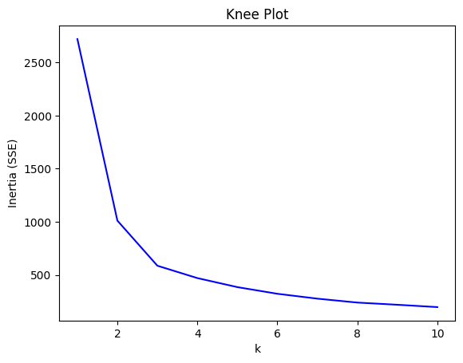
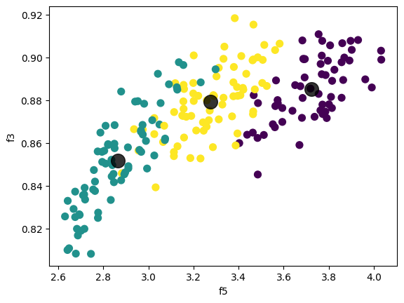
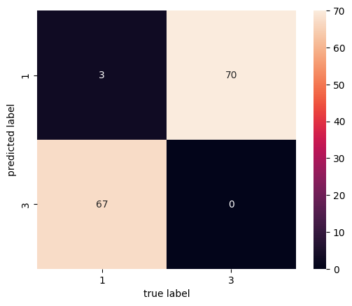

# Group 3. R = 2: class L = 1 (negative) and L = 3 (positive)
ID - U43517028  8//3 = 2

## Question 1
### Q1 1.

Accuracy - 0.9571428571428572



### Q1 2.

Accuracy - 0.4857142857142857



### Q1 3.

Accuracy - 0.9428571428571428



## Question 2 My Classifier - Logistic Regression

### Q2 1.

Accuracy - 0.9571428571428572


### Q2 2.

```
Model	TP	FP	TN	FN	accuracy	TPR	TNR
linear SVM	36	3	31	0	0.957143	1.000000	0.911765
Gaussian SVM	0	0	34	36	0.485714	0.000000	1.000000
polynomial SVM	35	3	31	1	0.942857	0.972222	0.911765
Logistic Regression	36	3	31	0	0.957143	1.000000	0.911765
```

Logistic Regression has the same stats as Linear SVM and both have the highest accuracy. While the other SVM methods have lower accuracy especially guassian SVM.

## Question 3

### Q3 1.


Best k = 3


### Q3 2.



There are few points which are closer to other centroids but they still belong to their own centroid. Because the grph is of 2 dimensions concerning only two features while the kMeans cluster are calculated for 7 features, which is 7 dimensions. Hence you can see such irregularity because of lower dimension visualization.

### Q3 3.
0th cluster = Label 2\
1st cluster = Label 3\
2nd cluster = Label 1

0th cluster Centroid = [18.72180328, 16.29737705,  0.88508689,  6.20893443,  3.72267213,3.60359016,  6.06609836,  1.98360656]\
1st cluster Centroid = [11.90906667, 13.25026667,  0.85154933,  5.22233333,  2.86509333, 4.72218667,  5.09304   ,  2.86666667]\
2nd cluster Centroid = [14.63202703, 14.45324324,  0.8790973 ,  5.56178378,  3.27489189, 2.74404324,  5.18493243,  1.13513514]

### Q3 4.

Accuracy - 0.3476190476190476

### Q3 5.



```
Model	TP	FP	TN	FN	accuracy	TPR	TNR
linear SVM	36	3	31	0	0.957143	1.000000	0.911765
Gaussian SVM	0	0	34	36	0.485714	0.000000	1.000000
polynomial SVM	35	3	31	1	0.942857	0.972222	0.911765
Logistic Regression	36	3	31	0	0.957143	1.000000	0.911765
K Means	0	67	3	70	0.021429	0.000000	0.042857
```

The K means seems to have the worst accuracy of all. This gives a perspective of the data which indicates the data is not expected to be clustered.