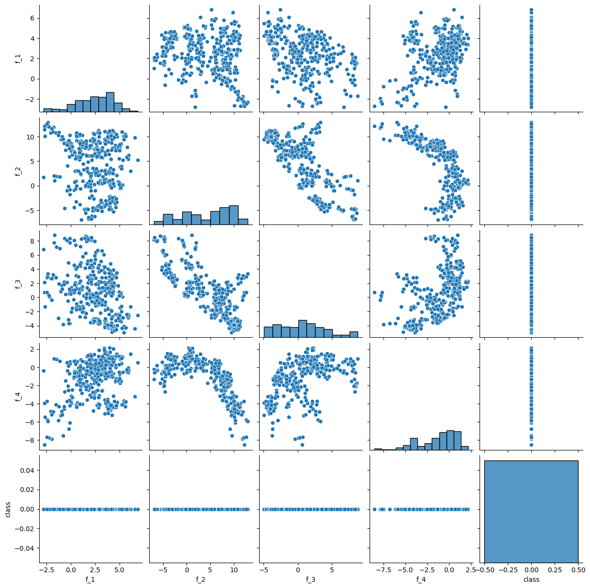
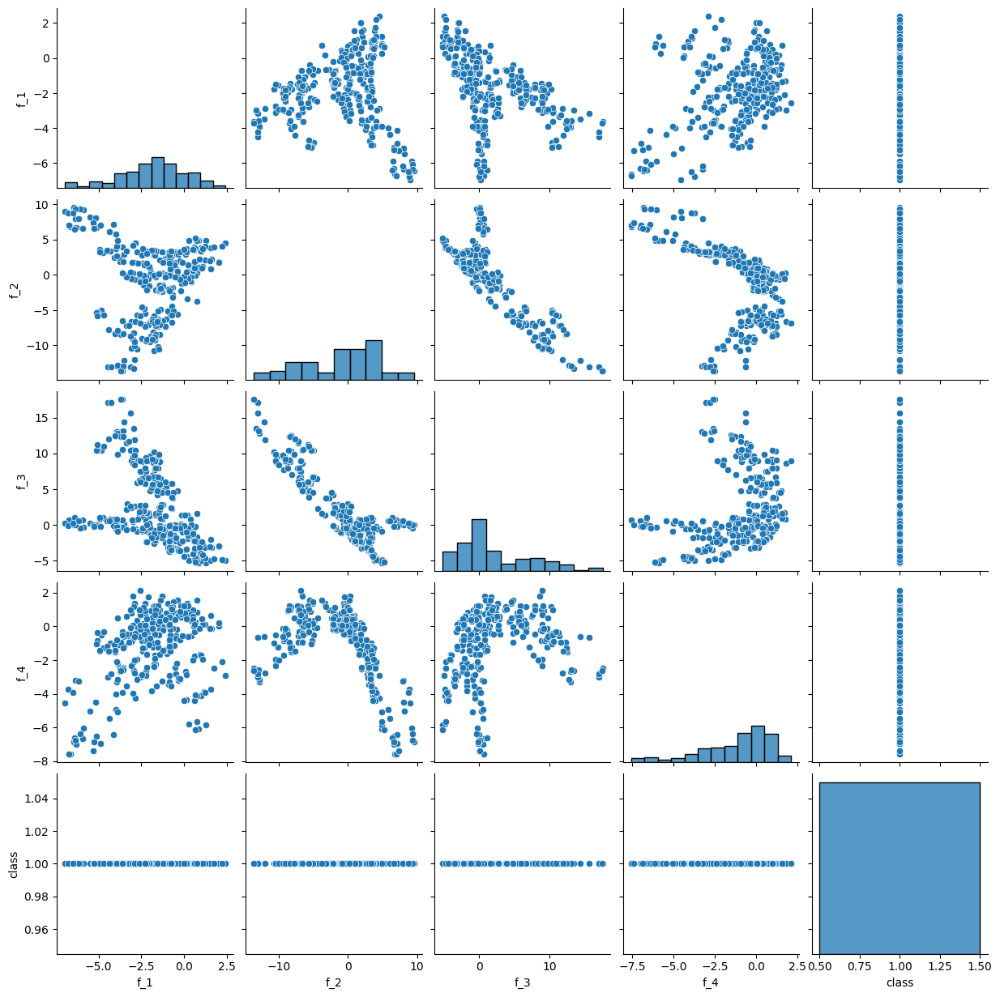
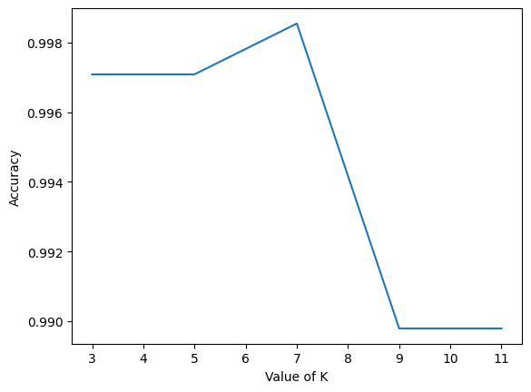

## Question 1
### Q1 1.
```
	f_1	f_2	f_3	f_4	class	color
0	3.62160	8.66610	-2.8073	-0.44699	0	green
1	4.54590	8.16740	-2.4586	-1.46210	0	green
2	3.86600	-2.63830	1.9242	0.10645	0	green
3	3.45660	9.52280	-4.0112	-3.59440	0	green
4	0.32924	-4.45520	4.5718	-0.98880	0	green
...	...	...	...	...	...	...
1367	0.40614	1.34920	-1.4501	-0.55949	1	red
1368	-1.38870	-4.87730	6.4774	0.34179	1	red
1369	-3.75030	-13.45860	17.5932	-2.77710	1	red
1370	-3.56370	-8.38270	12.3930	-1.28230	1	red
1371	-2.54190	-0.65804	2.6842	1.19520	1	red
1372 rows × 6 columns
```

### Q1 2. 

```
	µ(f1)	σ(f1)	µ(f2)	σ(f2)	µ(f3)	σ(f3)	µ(f4)	σ(f4)
0	2.276686	2.019348	4.256627	5.138792	0.796718	3.239894	-1.147640	2.125077
1	-1.868443	1.881183	-0.993576	5.404884	2.148271	5.261811	-1.246641	2.070984
all	0.433735	2.842763	1.922353	5.869047	1.397627	4.310030	-1.191657	2.101013
```

### Q1 3.
Most of the f1 and f2 frequency values of class 0 is positive while the frequency values of class 1 is negative. 


## Question 2

### Q2 1.
Good Bills

Fake Bills


### Q2 2.
```
if ( f_1 > -1) and ( f_2 > 5) and ( f_4 > -7):
	x = " good "
else :
	x = " fake "
```

### Q2 3.
```
	f_1	f_2	f_3	f_4	class	color	predict
686	0.722520	-0.053811	5.67030	-1.350900	0	green	red
687	0.188680	0.701480	-0.51182	0.005589	1	red	red
688	-2.178600	-6.447900	6.03440	-0.207770	1	red	red
689	5.807000	5.009700	-2.23840	0.438780	0	green	green
690	2.084300	6.625800	0.48382	-2.213400	0	green	green
...	...	...	...	...	...	...	...
1367	0.929700	-3.797100	4.64290	-0.295700	0	green	red
1368	-1.587700	-6.607200	5.80220	0.315930	1	red	red
1369	1.105000	7.443200	0.41099	-3.033200	0	green	green
1370	0.045304	6.733400	1.07080	-0.933200	0	green	green
1371	4.934200	2.410700	-0.17594	1.624500	0	green	red
```

### Q2 4.

TP - 163 , FP - 1 , TN - 302 , FN -  220\
TPR - 0.4255874673629243\
TNR - 0.9966996699669967

### Q2 5.

```
	TP	FP	TN	FN	accuracy	TPR	TNR
163	1	302	220	0.677843	0.425587	0.9967
```

### Q2 6.

The accuracy of the simple classifier is 0.677843(66.78%), which is better than a coin toss.

## Question 3
### Q3 1.

Accuracy of KNN whos k = 3 : 0.9912536443148688\
Accuracy of KNN whos k = 5 : 0.9912536443148688\
Accuracy of KNN whos k = 7 : 0.9912536443148688\
Accuracy of KNN whos k = 9 : 0.9854227405247813\
Accuracy of KNN whos k = 11 : 0.9868804664723032

### Q3 2.


### Q3 3.
```
TP	FP	TN	FN	accuracy	TPR	TNR
376	0	303	7	0.989796	0.981723	1.0
```

### Q3 4.
The KNN classifier is better than simple classifier in every aspect

### Q3 5.
BU ID - U43517028\
BU ID predicted class using simple classifier : 1\
BU ID predicted class using KNN : 0

## Question 4
### Q4 1.

Accuracy for the columns ['f_2', 'f_3', 'f_4'] when using KNN algorithm : 0.9606413994169096\
Accuracy for the columns ['f_1', 'f_3', 'f_4'] when using KNN algorithm : 0.967930029154519\
Accuracy for the columns ['f_1', 'f_2', 'f_4'] when using KNN algorithm : 0.9708454810495627\
Accuracy for the columns ['f_1', 'f_2', 'f_3'] when using KNN algorithm : 0.9956268221574344

### Q4 2.

Yes the accuracy increased in the case of using ['f_1', 'f_2', 'f_3'] frequencies when compared to using all four the frequencies.

### Q4 3.

Removing f1 frequency contributed the most to loss of accuracy.

### Q4 4.

Removing f4 frequency contributed the least to loss of accuracy.


## Question 5
### Q5 1.

Logistic Regression accuracy : 0.9897959183673469

### Q5 2.
```
TP	FP	TN	FN	accuracy	TPR	TNR
377	1	302	6	0.989796	0.984334	0.9967
```

### Q5 3.
The Logistic Regression is better than simple classifier in every aspect except False Positive(FP)

### Q5 4.
The Logistic Regression and KNN share the same accuracy but the TNR of the KNN algorithm is better than the Logistic Regression.

### Q5 5.
BU ID predicted class using simple classifier : 1\
BU ID predicted class using Logistic Regression : 0\
The predicted label is same for both Logistic Regression KNN algorithm.


## Question 6
### Q6 1.
Accuracy for the columns ['f_2', 'f_3', 'f_4'] when using Logistic Regression algorithm : 0.8032069970845481\
Accuracy for the columns ['f_1', 'f_3', 'f_4'] when using Logistic Regression algorithm : 0.8950437317784257\
Accuracy for the columns ['f_1', 'f_2', 'f_4'] when using Logistic Regression algorithm : 0.8717201166180758\
Accuracy for the columns ['f_1', 'f_2', 'f_3'] when using Logistic Regression algorithm : 0.9897959183673469\


### Q6 2.
The accuracy for ['f_1', 'f_2', 'f_3'] frequencies is quite similar to the accuracy when all four are used.

### Q6 3.
Removing f1 frequency contributed the most to loss of accuracy.

### Q6 4.
Removing f4 frequency contributed the least to loss of accuracy.

### Q6 5.
Yes the relative significance of features is the same as obtained using KNN algorithm.