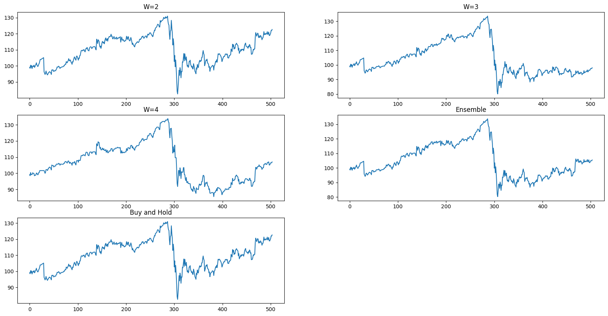

## Question 1
### Q1 1.
S&P-500
```
	Date	Return	True Label
0	2016-01-04	0.000000	+
1	2016-01-05	0.001692	+
2	2016-01-06	-0.012614	-
3	2016-01-07	-0.023992	-
4	2016-01-08	-0.010977	-
...	...	...	...
1253	2020-12-23	0.000899	+
1254	2020-12-24	0.003890	+
1255	2020-12-28	0.008591	+
1256	2020-12-29	-0.001908	-
1257	2020-12-30	0.001427	+
1258 rows × 3 columns
```

KO stock
```
    Date	Return	True Label
0	2016-01-04	0.000000	+
1	2016-01-05	0.003538	+
2	2016-01-06	-0.005405	-
3	2016-01-07	-0.016541	-
4	2016-01-08	-0.002643	-
...	...	...	...
1253	2020-12-23	0.006065	+
1254	2020-12-24	0.006782	+
1255	2020-12-28	0.013473	+
1256	2020-12-29	-0.000554	-
1257	2020-12-30	0.005727	+
```

### Q1 2. 

S&P-500 p* = 0.5543766578249337\
KO p* = 0.5411140583554377

### Q1 3.

S&P-500 k=1:\
-- : 0.32432432432432434\
-+ : 0.6756756756756757\
S&P-500 k=2:\
--- : 0.3076923076923077\
--+ : 0.6923076923076923\
S&P-500 k=3:\
---- : 0.2857142857142857\
---+ : 0.7142857142857143

KO k=1:\
-- : 0.3708609271523179\
-+ : 0.6291390728476821\
KO k=2:\
--- : 0.31343283582089554\
--+ : 0.6865671641791045\
KO k=3:\
---- : 0.3103448275862069\
---+ : 0.6896551724137931

### Q1 4. 

S&P-500 k=1:\
++ : 0.41690962099125367\
+- : 0.5830903790087464\
S&P-500 k=2:\
+++ : 0.38285714285714284\
++- : 0.6171428571428571\
S&P-500 k=3:\
++++ : 0.30952380952380953\
+++- : 0.6904761904761905

KO k=1:\
++ : 0.43283582089552236\
+- : 0.5671641791044776\
KO k=2:\
+++ : 0.3614457831325301\
++- : 0.6385542168674698\
KO k=3:\
++++ : 0.38095238095238093\
+++- : 0.6190476190476191

## Question 2

### Q2 1. 
S&P-500
```
	Date	Return	True Label	Predict Label 2	Predict Label 3	Predict Label 4
754	2019-01-02	0.001040	+	+	+	-
755	2019-01-03	-0.023863	-	+	+	+
756	2019-01-04	0.033496	+	+	+	+
757	2019-01-07	0.007885	+	+	+	-
758	2019-01-08	0.009395	+	+	+	+
...	...	...	...	...	...	...
1253	2020-12-23	0.000899	+	+	+	+
1254	2020-12-24	0.003890	+	+	+	+
1255	2020-12-28	0.008591	+	+	+	+
1256	2020-12-29	-0.001908	-	+	-	-
1257	2020-12-30	0.001427	+	+	+	+
504 rows × 6 columns
```
KO
```
	Date	Return	True Label	Predict Label 2	Predict Label 3	Predict Label 4
754	2019-01-02	-0.008870	-	+	+	+
755	2019-01-03	-0.006179	-	+	+	+
756	2019-01-04	0.019940	+	+	+	+
757	2019-01-07	-0.013034	-	+	+	+
758	2019-01-08	0.011289	+	+	+	-
...	...	...	...	...	...	...
1253	2020-12-23	0.006065	+	+	+	+
1254	2020-12-24	0.006782	+	+	+	+
1255	2020-12-28	0.013473	+	+	-	-
1256	2020-12-29	-0.000554	-	+	+	+
1257	2020-12-30	0.005727	+	+	+	+
504 rows × 6 columns
```
### Q2 2.
S&P-500\
W = 2 accuracy of '+' :  1.0\
W = 2 accuracy of '-' :  0.0\
W = 2 total accuracy :  0.5853174603174603

W = 3 accuracy of '+' :  0.8372881355932204\
W = 3 accuracy of '-' :  0.22966507177033493\
W = 3 total accuracy :  0.5853174603174603

W = 4 accuracy of '+' :  0.8\
W = 4 accuracy of '-' :  0.2583732057416268\
W = 4 total accuracy :  0.5753968253968254

KO\
W = 2 accuracy of '+' :  1.0\
W = 2 accuracy of '-' :  0.0\
W = 2 accuracy -  0.5337301587301587

W = 3 accuracy of '+' :  0.8661710037174721\
W = 3 accuracy of '-' :  0.12340425531914893\
W = 3 accuracy -  0.5198412698412699

W = 4 accuracy of '+' :  0.6468401486988847\
W = 4 accuracy of '-' :  0.28936170212765955\
W = 4 accuracy -  0.4801587301587302

### Q2 3.
W=2 accuracy is the highest for the KO stock\
W=2 and W=3 accuracies are the highest for the S&P-500 stock

## Question 3
### Q3 1.
S&P-500
```
	Date	Return	True Label	Predict Label 2	Predict Label 3	Predict Label 4	Ensemble Predict
754	2019-01-02	0.001040	+	+	+	-	+
755	2019-01-03	-0.023863	-	+	+	+	+
756	2019-01-04	0.033496	+	+	+	+	+
757	2019-01-07	0.007885	+	+	+	-	+
758	2019-01-08	0.009395	+	+	+	+	+
...	...	...	...	...	...	...	...
1253	2020-12-23	0.000899	+	+	+	+	+
1254	2020-12-24	0.003890	+	+	+	+	+
1255	2020-12-28	0.008591	+	+	+	+	+
1256	2020-12-29	-0.001908	-	+	-	-	-
1257	2020-12-30	0.001427	+	+	+	+	+
504 rows × 7 columns
```
KO
```
	Date	Return	True Label	Predict Label 2	Predict Label 3	Predict Label 4	Ensemble Predict
754	2019-01-02	-0.008870	-	+	+	+	+
755	2019-01-03	-0.006179	-	+	+	+	+
756	2019-01-04	0.019940	+	+	+	+	+
757	2019-01-07	-0.013034	-	+	+	+	+
758	2019-01-08	0.011289	+	+	+	-	+
...	...	...	...	...	...	...	...
1253	2020-12-23	0.006065	+	+	+	+	+
1254	2020-12-24	0.006782	+	+	+	+	+
1255	2020-12-28	0.013473	+	+	-	-	-
1256	2020-12-29	-0.000554	-	+	+	+	+
1257	2020-12-30	0.005727	+	+	+	+	+
504 rows × 7 columns
```
### Q3 2.
S&P-500\
Ensemble accuracy of '+' :  0.9220338983050848\
Ensemble accuracy of '-' :  0.11961722488038277\
Ensemble total accuracy :  0.5892857142857143

KO\
Ensemble accuracy of '+' :  0.9368029739776952\
Ensemble accuracy of '-' :  0.05106382978723404\
Ensemble total accuracy :  0.5238095238095238

### Q3 3.
For S&P-500 the accuracy of predicting '-' in ensemble is better than only W=2\
For KO the accuracy of predicting '-' in ensemble is better than only W=2

### Q3 4.
For S&P-500 the accuracy of predicting '+' in ensemble is better than W=3 and W=4\
For KO the accuracy of predicting '+' in ensemble is better than W=3 and W=4

## Question 4
### Q4 1., 2., 3., 4., 5., 6.
S&P-500\
W=2\
TP - 295 , FP - 209 , TN - 0 , FN -  0\
TPR - 1.0\
TNR - 0.0

W=3\
TP - 247 , FP - 161 , TN - 48 , FN -  48\
TPR - 0.8372881355932204\
TNR - 0.22966507177033493

W=4\
TP - 236 , FP - 155 , TN - 54 , FN -  59\
TPR - 0.8\
TNR - 0.2583732057416268

Ensemble\
TP - 272 , FP - 184 , TN - 25 , FN -  23\
TPR - 0.9220338983050848\
TNR - 0.11961722488038277

KO\
W=2\
TP - 269 , FP - 235 , TN - 0 , FN -  0\
TPR - 1.0\
TNR - 0.0

W=3\
TP - 233 , FP - 206 , TN - 29 , FN -  36\
TPR - 0.8661710037174721\
TNR - 0.12340425531914893

W=4\
TP - 174 , FP - 167 , TN - 68 , FN -  95\
TPR - 0.6468401486988847\
TNR - 0.28936170212765955

Ensemble\
TP - 252 , FP - 223 , TN - 12 , FN -  17\
TPR - 0.9368029739776952\
TNR - 0.05106382978723404

### Q4 7.

|index  | W	|ticker	|TP	|FP	|TN	|FN	|accuracy	|TPR|	TNR|
|---  | ---	|---	|---	|---	|---	|---	|---	|---|	---|
|0	|2	|S&P-500|	295.0|	209.0	|0.0	|0.0	|0.585317|	1.000000|	0.000000|
|1|	3	|S&P-500	|247.0|	161.0|	48.0|	48.0|	0.585317|	0.837288|	0.229665|
|2	|4	|S&P-500|	236.0|	155.0|	54.0|	59.0|	0.575397|	0.800000|	0.258373|
|3|	Ensemble|	S&P-500|	272.0|	184.0|	25.0|	23.0|	0.589286|	0.922034|	0.119617|
|4	|2|	KO	|269.0|	235.0|	0.0|	0.0	|0.533730|	1.000000|	0.000000|
|5|	3|	KO|	233.0|	206.0|	29.0|	36.0|	0.519841|	0.866171|	0.123404|
|6|	4|	KO|174.0|	167.0|	68.0|	95.0|	0.480159|	0.646840|	0.289362|
|7|	Ensemble|	KO|	252.0|	223.0|	12.0|	17.0	|0.523810|	0.936803|	0.051064|

### Q4 8.
w2 has highest TP and FP while it has the least TN and FN for both SPY and Ko ticker.

## Question 5
### Q5 1.

### Q5 2.
There is a huge dip in returns of the stock during the beginning of 2020 and then there was considerable rise of the returns.\
W=2 graph is the most similar to the Buy and Hold graph