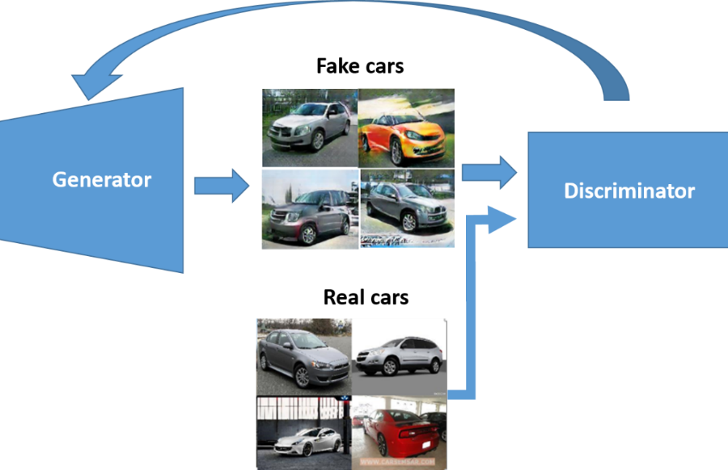
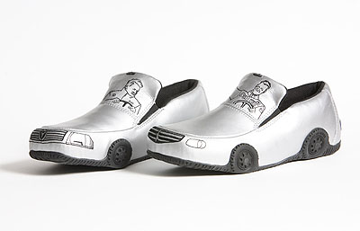

- Shatrugna Rao Korukanti
- BU ID is: U43517028 

# Project Proposal

## Generation of unique images from multiple image dataset using GAN 

Generative Adversarial Network (GAN) model will be used under the hood to generate new kinds of vehicle design.  

### Generate Image Of Cars
I will utilize [stanford car dataset](https://www.kaggle.com/datasets/jessicali9530/stanford-cars-dataset) for now, and expand the dataset   

### Future scope

I was thinking of combining different kind of image datasets like shoe and car to generate a unique image.\
Something like this 