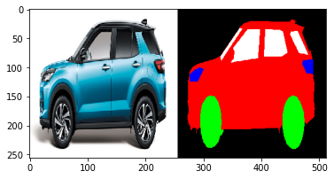
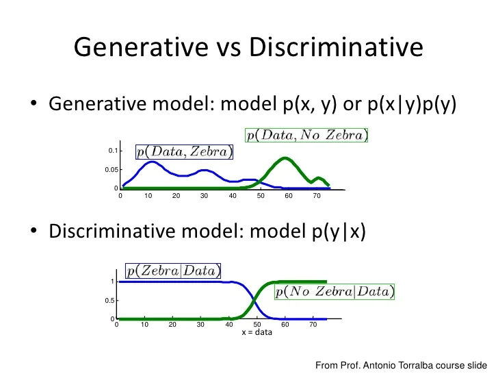
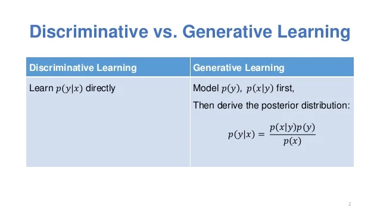
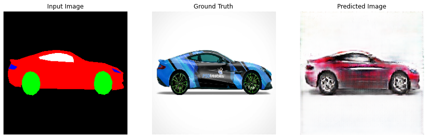
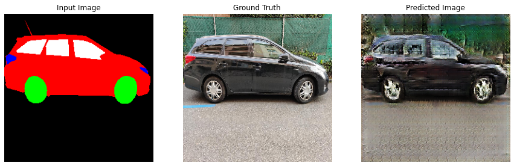
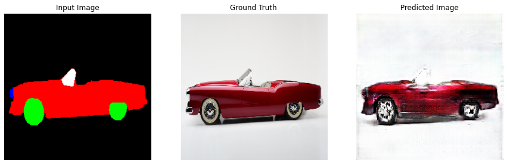
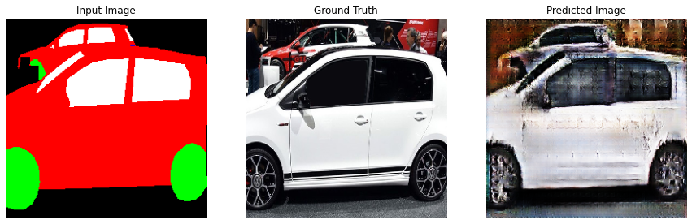
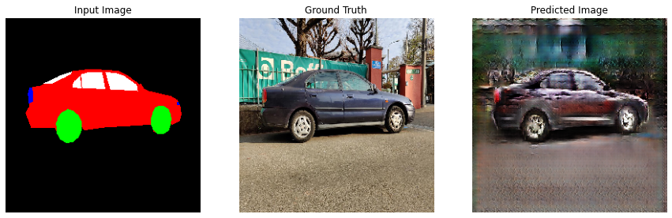
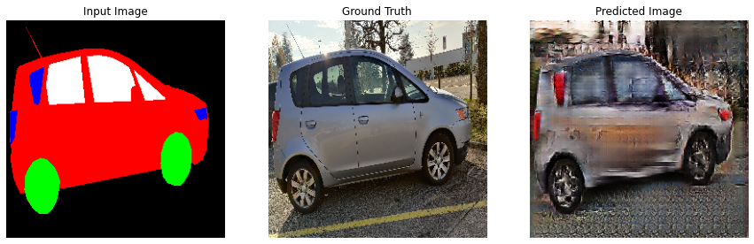

Name - Shatrugna Rao Korukanti\
ID - U43517028

# GAN pix2pix Car Model

[Colab Notebook](https://colab.research.google.com/drive/1AxcW8ALvVkLaIdX5DLbtUqmHdBdis43U?usp=sharing) Click here to open the colab notebook, train and test the model which takes about an hour for 40k training steps.

I have used an online kaggle dataset of car images and built the mask of the car images.

- Black (0,0,0) - Background
- Red (255,0,0) - Car body
- Green (0,255,0) - Tires
- Blue (0,0,255) - Head/Rear Lights
- White (255,255,255) - Windows

[https://github.com/Shatrugna-Strife/dataset/raw/main/car-segmentation.zip](https://github.com/Shatrugna-Strife/dataset/raw/main/car-segmentation.zip) Link to dataset

### Goal

Want to achieve a considerable understanding in GAN models by experimenting with image to image model generation.

## Generative Adversarial Networks GAN

Generative Models:

Aim to model how the data is generated. From P(x|c)×P(c)P(x|c)×P(c) we can obtain P(c|x)P(c|x) (see Bayes' Theorem). - They try to learn a joint probability distribution P(x,c)P(x,c)

Pros:
- We have the knowledge about the data distribution.

Cons:
- Very expensive to get (a lot of parameters)
- Need lots of data

Discriminative Models:

Aim at learning P(c|x)P(c|x) by using probabilistic approaches (e.g., logistic regression), or by mapping classes from a set of points (e.g., perceptrons and SVMs).

Pros:
- Easy to model

Cons:
- To classify, but not to generate the data.

## GAN pix2pix

Pix2Pix is a Generative Adversarial Network, or GAN, model designed for general purpose image-to-image translation.

The approach was presented by Phillip Isola, et al. in their 2016 paper titled “Image-to-Image Translation with Conditional Adversarial Networks” and presented at CVPR in 2017.

The GAN architecture is an approach to training a generator model, typically used for generating images. A discriminator model is trained to classify images as real (from the dataset) or fake (generated), and the generator is trained to fool the discriminator model.

### U-Net Generator Model
The generator model takes an image as input, and unlike a traditional GAN model, it does not take a point from the latent space as input.

Instead, the source of randomness comes from the use of dropout layers that are used both during training and when a prediction is made.

### PatchGAN Discriminator Model
The discriminator model takes an image from the source domain and an image from the target domain and predicts the likelihood of whether the image from the target domain is a real or generated version of the source image.

- Input: Image from source domain, and Image from the target domain.
- Output: Probability that the image from the target domain is a real translation of the source image.

The input to the discriminator model highlights the need to have an image dataset comprised of paired source and target images when training the model.

Unlike the traditional GAN model that uses a deep convolutional neural network to classify images, the Pix2Pix model uses a PatchGAN. This is a deep convolutional neural network designed to classify patches of an input image as real or fake, rather than the entire image.

A patch size of `70×70` was found to be effective across a range of image-to-image translation tasks

### Discriminator loss

- The discriminator_loss function takes 2 inputs: real images and generated images.

- `real_loss` is a sigmoid cross-entropy loss of the real images and an array of ones(since these are the real images).

- `generated_loss` is a sigmoid cross-entropy loss of the generated images and an array of zeros (since these are the fake images).

- The total_loss is the sum of real_loss and generated_loss.

### Generator loss
- The generator loss is a sigmoid cross-entropy loss of the generated images and an array of ones.
- The pix2pix paper mentions the L1 loss, which is a MAE (mean absolute error) between the generated image and the target image.
- This allows the generated image to become structurally similar to the target image.
- The formula to calculate the total generator loss is `gan_loss + LAMBDA * l1_loss`, where `LAMBDA = 100`. This value was decided by the authors of the paper.

## Results

The model generated images with considerable quality despite training it only for 1 hour in google colab.

Increasing the training time could generate a quality result.

## Future Scope

- Should be able to train the model with variable image sizes. The model is constrained to use 256x256 pixel image.
- Beside Cars, should be able to train images with multiple more segmentation like road, tree, buildings, and more.